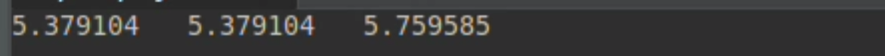

# TP - Systèmes embarqués motorisés

- Arnaud SIBENALER

Lien Github : https://github.com/ArnaudS-CPE/TP_MOTOR

L'objectif du TP est de mettre en oeuvre le système décrit dans le schéma suivant sur un carte STM32 NUCLEO-F401RE, avec un moteur-réducteur-codeur (Pololu 75:1), un pont en H (DRV8833), et un accéléromètre (MPU-6050). Les codes seront réalisés sur STM32CubeIDE (version 1.17.0)


## Mise en place

On créé un projet STM32 en séléctionnant la carte nucleo que nous utilisons.

On configure ensuite deux timers :
- le timer 1 avec 2 sorties PWM pour le pilotage du moteur
- le timer 3 avec 2 entrées encoder pour la lecture du codeur

On configure également un port I2C qui sera utilisé communiquer avec l'accéléromètre.

On laisse la fréquence des timers à leur valeur par défaut (84MHz).

On créé ensuite la fonction suivante dans le fichier `main.c`  pour faire clignoter la LED de la carte à 1Hz:

```c
void HAL_SYSTICK_Callback(void){
	static uint16_t tempoNms = 500;
	if(tempoNms > 0 )
		tempoNms--;
	else{
		tempoNms = 500;
		HAL_GPIO_TogglePin(LD2_GPIO_Port, LD2_Pin);
	}
}
```

On ajoute également la ligne  suivante à la fonction _SysTick_Handler_ du fichier `stm32f4xx_it.c` :

```c
HAL_SYSTICK_IRQHandler();
```

Le mot clé __weak dans la déclaration de la fonction signifie que cette fonction peut être redéfinie dans un autre fichier du projet. Cela permet de toujours définir la fonction _HAL_SYSTICK_Callback_, et de laisser la possibilité de la modifier si besoin dans un autre fichier.

Le SysTick est un timer interne des microcrotrôlleur STM32. Il sert notamment de base de temps pour plusieurs fonction comme _HAL_Delay_, et peut être utilisé sans configurer de timer supplémentaire.
Source : https://deepbluembedded.com/stm32-systick-timer-microseconds-delay-us-delay-function/

On ajoute ensuite la fonction suivante pour pouvoir utiliser la fonction _printf_ et afficher le résultat dans un terminal série :

```c
int __io_putchar(int ch){
    HAL_UART_Transmit(&huart2, (uint8_t *)&ch, 1, 0xFFFF);
    return ch;
}
```

## Pilotage du pont en H et du moteur

Le code suivant du fichier `tim.c` permet de contrôler le timer 1, permettant de générer les signaux PWM :

```c
/* TIM1 init function */
void MX_TIM1_Init(void)
{

  /* USER CODE BEGIN TIM1_Init 0 */

  /* USER CODE END TIM1_Init 0 */

  TIM_ClockConfigTypeDef sClockSourceConfig = {0};
  TIM_MasterConfigTypeDef sMasterConfig = {0};
  TIM_OC_InitTypeDef sConfigOC = {0};
  TIM_BreakDeadTimeConfigTypeDef sBreakDeadTimeConfig = {0};

  /* USER CODE BEGIN TIM1_Init 1 */

  /* USER CODE END TIM1_Init 1 */
  htim1.Instance = TIM1;
  htim1.Init.Prescaler = 0;
  htim1.Init.CounterMode = TIM_COUNTERMODE_UP;
  htim1.Init.Period = 4200;
  htim1.Init.ClockDivision = TIM_CLOCKDIVISION_DIV1;
  htim1.Init.RepetitionCounter = 0;
  htim1.Init.AutoReloadPreload = TIM_AUTORELOAD_PRELOAD_ENABLE;
  if (HAL_TIM_Base_Init(&htim1) != HAL_OK)
  {
    Error_Handler();
  }
  sClockSourceConfig.ClockSource = TIM_CLOCKSOURCE_INTERNAL;
  if (HAL_TIM_ConfigClockSource(&htim1, &sClockSourceConfig) != HAL_OK)
  {
    Error_Handler();
  }
  if (HAL_TIM_PWM_Init(&htim1) != HAL_OK)
  {
    Error_Handler();
  }
  sMasterConfig.MasterOutputTrigger = TIM_TRGO_RESET;
  sMasterConfig.MasterSlaveMode = TIM_MASTERSLAVEMODE_DISABLE;
  if (HAL_TIMEx_MasterConfigSynchronization(&htim1, &sMasterConfig) != HAL_OK)
  {
    Error_Handler();
  }
  sConfigOC.OCMode = TIM_OCMODE_PWM1;
  sConfigOC.Pulse = 0;
  sConfigOC.OCPolarity = TIM_OCPOLARITY_HIGH;
  sConfigOC.OCNPolarity = TIM_OCNPOLARITY_HIGH;
  sConfigOC.OCFastMode = TIM_OCFAST_DISABLE;
  sConfigOC.OCIdleState = TIM_OCIDLESTATE_RESET;
  sConfigOC.OCNIdleState = TIM_OCNIDLESTATE_RESET;
  if (HAL_TIM_PWM_ConfigChannel(&htim1, &sConfigOC, TIM_CHANNEL_1) != HAL_OK)
  {
    Error_Handler();
  }
  if (HAL_TIM_PWM_ConfigChannel(&htim1, &sConfigOC, TIM_CHANNEL_2) != HAL_OK)
  {
    Error_Handler();
  }
  sBreakDeadTimeConfig.OffStateRunMode = TIM_OSSR_DISABLE;
  sBreakDeadTimeConfig.OffStateIDLEMode = TIM_OSSI_DISABLE;
  sBreakDeadTimeConfig.LockLevel = TIM_LOCKLEVEL_OFF;
  sBreakDeadTimeConfig.DeadTime = 0;
  sBreakDeadTimeConfig.BreakState = TIM_BREAK_DISABLE;
  sBreakDeadTimeConfig.BreakPolarity = TIM_BREAKPOLARITY_HIGH;
  sBreakDeadTimeConfig.AutomaticOutput = TIM_AUTOMATICOUTPUT_DISABLE;
  if (HAL_TIMEx_ConfigBreakDeadTime(&htim1, &sBreakDeadTimeConfig) != HAL_OK)
  {
    Error_Handler();
  }
  /* USER CODE BEGIN TIM1_Init 2 */

  /* USER CODE END TIM1_Init 2 */
  HAL_TIM_MspPostInit(&htim1);

}
```

On branche ensuite le moteur au pont en H selon le schéma suivant (on utilise un seul des deux ponts en H de la carte) :


On ajoute également deux résistance de pull-down (de 10kΩ) à l'entrée du pont pour que le moteur ne tourne pas lors du chargement du programme ou lors d'un appui sur le bouton _reset_.

On configure ensuite la fréquence du PWM à 20kHz. Pour cela, on fixe la valeur de la période du timer à 4200, car 84MHz/20kHz = 4200.

On créé le fichier `motor.h` :

```c
#ifndef MOTOR_H
#define MOTOR_H

void Motor_Init(void);
void Motor_Pwm_Update(float in);
#endif
```

et le fichier `motor.c` :

```c
#include "motor.h"
#include "tim.h"
#include <stdio.h>
#include <math.h>

void Motor_Init(void){ //initialisation du moteur
	HAL_TIM_PWM_Start(&htim1, TIM_CHANNEL_1);
	HAL_TIM_PWM_Start(&htim1, TIM_CHANNEL_2);

	htim1.Instance->CCR1 = htim1.Init.Period/2; //on fixe une rapport cyclique pour tester
	htim1.Instance->CCR2 = htim1.Init.Period/4; //commente par la suite
}

void Motor_Pwm_Update(float in){ //changement de sens/vitesse
	if(in > 1.0){
		in = 1.0;
	}
	if(in < -1.0){
		in = -1.0;
	}

	uint32_t speed = htim1.Init.Period - (uint32_t)(fabs(in) * htim1.Init.Period); //calcul du rapport cyclique
	if(in > 0.0f){
		htim1.Instance->CCR1 = speed;
		htim1.Instance->CCR2 = htim1.Init.Period;}
	if(in < 0.0f){
		htim1.Instance->CCR2 = speed;
		htim1.Instance->CCR1 = htim1.Init.Period;}
	if(in == 0.0f){
		htim1.Instance->CCR1 = htim1.Init.Period; //2 sorties a l'etat haut => moteur a l'arret
		htim1.Instance->CCR2 = htim1.Init.Period;}
}
```

La fonction _Motor_Init_ permet d'initialiser les PWM, et de générer des signaux des rapport cyclique 50% et 25% sur les sorties 1 et 2.
On visualise ces signaux à l'oscilloscope :

|  |  |
|-------------------|-------------------|

La fonction _Motor_Pwm_Update_ prend en entrée un flotant et permet de modifier la vitesse et le sens de rotation du moteur. Pour cela, on modifier la rapport cyclique d'une des sorties pour qu'il soit proportionnel à la valeur d'entrée, et on fixe l'autre sortie à l'état haut.
Pour changer le sens de rotation, on échange les deux sorties.

On initialise le moteur dans le `main.c`, et on test le bon fonctionnement de la fonction _Motor_Pwm_Update_ en l'appelant dans la fonction _main_.


## Lecture du codeur

Le code suivant du fichier `tim.c` permet de contrôler le timer 3, permettant de lire les valeurs de l'encodeur :


```c
/* TIM3 init function */
void MX_TIM3_Init(void)
{

  /* USER CODE BEGIN TIM3_Init 0 */

  /* USER CODE END TIM3_Init 0 */

  TIM_Encoder_InitTypeDef sConfig = {0};
  TIM_MasterConfigTypeDef sMasterConfig = {0};

  /* USER CODE BEGIN TIM3_Init 1 */

  /* USER CODE END TIM3_Init 1 */
  htim3.Instance = TIM3;
  htim3.Init.Prescaler = 0;
  htim3.Init.CounterMode = TIM_COUNTERMODE_UP;
  htim3.Init.Period = 65535;
  htim3.Init.ClockDivision = TIM_CLOCKDIVISION_DIV1;
  htim3.Init.AutoReloadPreload = TIM_AUTORELOAD_PRELOAD_ENABLE;
  sConfig.EncoderMode = TIM_ENCODERMODE_TI1;
  sConfig.IC1Polarity = TIM_ICPOLARITY_RISING;
  sConfig.IC1Selection = TIM_ICSELECTION_DIRECTTI;
  sConfig.IC1Prescaler = TIM_ICPSC_DIV1;
  sConfig.IC1Filter = 10;
  sConfig.IC2Polarity = TIM_ICPOLARITY_RISING;
  sConfig.IC2Selection = TIM_ICSELECTION_DIRECTTI;
  sConfig.IC2Prescaler = TIM_ICPSC_DIV1;
  sConfig.IC2Filter = 0;
  if (HAL_TIM_Encoder_Init(&htim3, &sConfig) != HAL_OK)
  {
    Error_Handler();
  }
  sMasterConfig.MasterOutputTrigger = TIM_TRGO_RESET;
  sMasterConfig.MasterSlaveMode = TIM_MASTERSLAVEMODE_DISABLE;
  if (HAL_TIMEx_MasterConfigSynchronization(&htim3, &sMasterConfig) != HAL_OK)
  {
    Error_Handler();
  }
  /* USER CODE BEGIN TIM3_Init 2 */

  /* USER CODE END TIM3_Init 2 */

}


void HAL_TIM_Encoder_MspDeInit(TIM_HandleTypeDef* tim_encoderHandle)
{

  if(tim_encoderHandle->Instance==TIM3)
  {
  /* USER CODE BEGIN TIM3_MspDeInit 0 */

  /* USER CODE END TIM3_MspDeInit 0 */
    /* Peripheral clock disable */
    __HAL_RCC_TIM3_CLK_DISABLE();

    /**TIM3 GPIO Configuration
    PA6     ------> TIM3_CH1
    PA7     ------> TIM3_CH2
    */
    HAL_GPIO_DeInit(GPIOA, GPIO_PIN_6|GPIO_PIN_7);

  /* USER CODE BEGIN TIM3_MspDeInit 1 */

  /* USER CODE END TIM3_MspDeInit 1 */
  }
}
```

On créé le fichier `encoder.h` :

```c
#ifndef ENCODER_H
#define ENCODER_H

typedef struct {
	float angle_rel;
	float angle_abs;
	float d_angle;
} Encoder_Feedback_t;

Encoder_Feedback_t Encoder_Read (void);
void Encoder_Init (void);

#endif
```

et le fichier `encoder.c` :

```c
#include "encoder.h"
#include "tim.h"
#include <stdio.h>
#include <math.h>

static float last_angle = 0;

Encoder_Feedback_t enc = {0.0f, 0.0f, 0.0f}; //creation de la variable encoder

void Encoder_Init (void){ //initialisation de l'encodeur
	HAL_TIM_Encoder_Start(&htim3, TIM_CHANNEL_ALL);
	htim3.Instance->CNT = 32767; //on fixe la valeur du compteur "au milieu" pour eviter les cas 0->65535 et 65535->0
}

Encoder_Feedback_t Encoder_Read (void){

	uint32_t val = htim3.Instance->CNT; //lecture de la valeur du compteur

	enc.angle_abs = enc.angle_abs + (float)((32767.0 - (float)val) * (float)M_PI * 2.0 / 24.0) / 75.0; //conversion en rad

	enc.angle_rel = enc.angle_abs; //angle [0;2*pi[]
	if(enc.angle_rel > 0.0){
		while(enc.angle_rel >= (float)(2*M_PI)){
			enc.angle_rel = enc.angle_rel - (float)(2*M_PI);};
	};
	if(enc.angle_rel < 0.0){
		while(enc.angle_rel <= 0.0){
			enc.angle_rel = enc.angle_rel + (float)(2*M_PI);};
	};

	float delta_angle = (enc.angle_abs - last_angle);
	enc.d_angle = delta_angle / 0.04; //vitesse de rotation en rad/s

	last_angle = enc.angle_abs;
	htim3.Instance->CNT = 32767; //reinitialisation du comteur a chaque lecture

	return enc;
}
```

On initialise le moteur dans le `main.c`, et on modifie la fonction _HAL_SYSTICK_Callback_ pour qu'en plus de faire clignoter la led, elle appelle la fonction _Encoder_Read_ toutes les 40ms :

```c
extern Encoder_Feedback_t encoder;

void HAL_SYSTICK_Callback(void){
	static uint16_t tempoNms = 500;
	static uint16_t tempoEncNms = 40;
	if(tempoNms > 0 )
		tempoNms--;
	else{
		tempoNms = 500;
		HAL_GPIO_TogglePin(LD2_GPIO_Port, LD2_Pin);
	}
	if(tempoEncNms > 0 )
		tempoEncNms--;
	else{
		tempoEncNms = 40;
		Encoder_Read();
	}
}
```

On affiche les valeurs mesurés avec de _printf_ dans la fonction _main_ (angle absolu, angle relatif, et vitesse de rotation):




## Ecriture d'un correcteur PID

On créé le fichier `pid.h` :

```c
#ifndef PID_H
#define PID_H

typedef struct {
	struct {
		float Kp; // Proportional coefficient
		float Ki; // Integral coefficient
		float Kd; // Derivative coefficient
		float integ_sat; // Windup control with integral saturation
		// so that abs(integ) <= abs(integ_sat)
		float error_stop; // Error below which integration stops
	} init;

	struct {
		float order; // order (what you want to reach)
		float feedback; // what you reached for now
	} input;

	struct {
		float error; // order - feedback
		float previous_error; // previous error... ^^
		float deriv; // i.e. output
		float integ; // i.e. output
		float output; // output = Ki*error + Ki*integ + Kd*deriv
	} process;
} PID_t;

void PID_Init(PID_t* pidHandle, float Kp, float Ki, float Kd, float windup, float error_stop);
float PID_Execute(PID_t* pidHandle);
#endif
```

et le fichier `pid.c` :

```c
#include "pid.h"
#include <math.h>

void PID_Init(PID_t* pidHandle, float Kp, float Ki, float Kd, float windup, float error_stop){
	//Initialisation des coefficients PID
	pidHandle->init.Kp = Kp;
	pidHandle->init.Ki = Ki;
	pidHandle->init.Kd = Kd;
	pidHandle->init.integ_sat = windup;
	pidHandle->init.error_stop = error_stop;

	//Initialisation des variables de processus
	pidHandle->process.error = 0.0f;
	pidHandle->process.previous_error = 0.0f;
	pidHandle->process.deriv = 0.0f;
	pidHandle->process.integ = 0.0f;
	pidHandle->process.output = 0.0f;
}

float PID_Execute(PID_t* pidHandle){

	pidHandle->process.error = pidHandle->input.order - pidHandle->input.feedback; //error

	pidHandle->process.deriv = pidHandle->process.error - pidHandle->process.previous_error; //derivate

    if (fabsf(pidHandle->process.error) > pidHandle->init.error_stop) { //integer
	    pidHandle->process.integ += pidHandle->process.error;
		if (pidHandle->process.integ > pidHandle->init.integ_sat) {
		    pidHandle->process.integ = pidHandle->init.integ_sat;
		} else if (pidHandle->process.integ < -pidHandle->init.integ_sat) {
		    pidHandle->process.integ = -pidHandle->init.integ_sat;
		}
    }

	pidHandle->process.output = pidHandle->init.Kp * pidHandle->process.error
	         	 	 	 	  + pidHandle->init.Ki * pidHandle->process.integ
							  - pidHandle->init.Kd * pidHandle->process.deriv;

	pidHandle->process.previous_error = pidHandle->process.error;

	return pidHandle->process.output;
}
```

On veut utiliser la valeur de _process.output_ en entrée de la fonction de contrôle du moteur. la sortie doit donc être une valeur entre -1 et 1. Si la valeur est supérieure à 1 ou inférieure à -1, la fonction de contrôle du moteur fixe la consigne à 1 ou -1, donc cela ne pose pas de problème.


## Mise en oeuvre du PID pour asservir le moteur en vitesse


