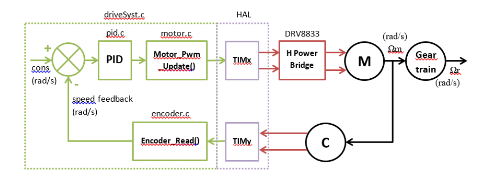
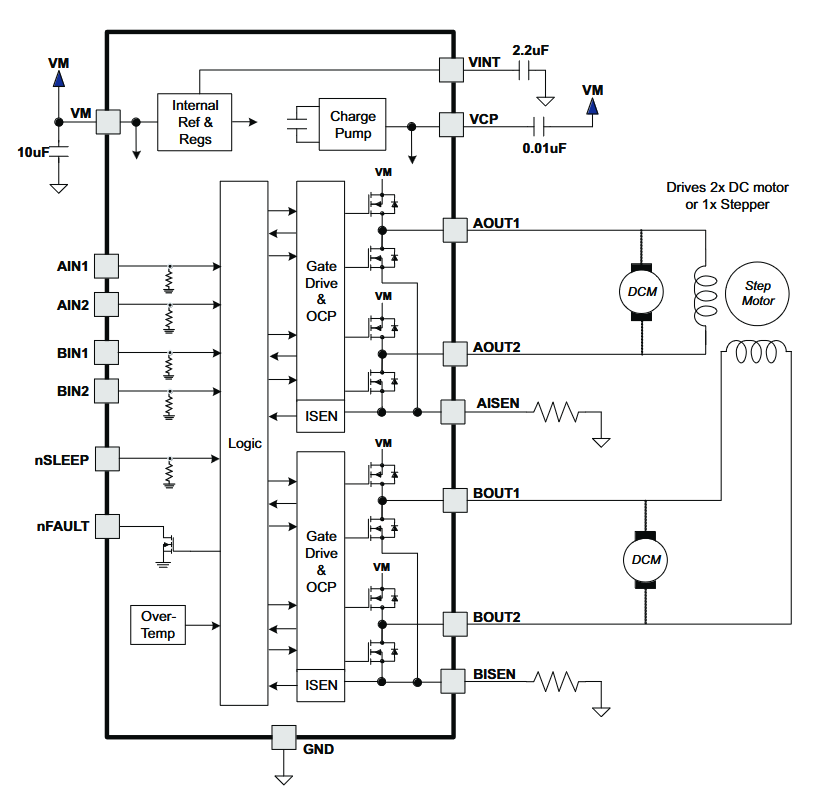
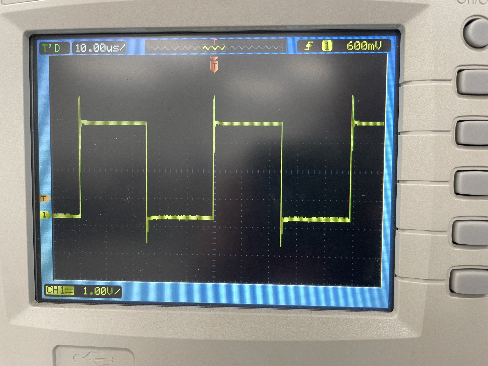
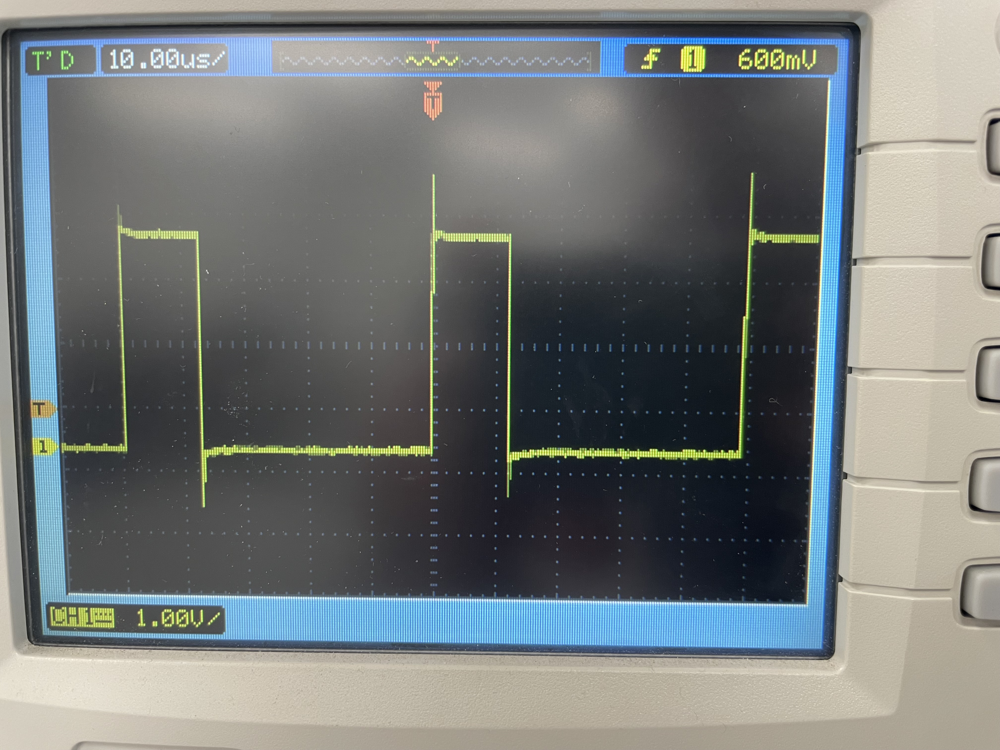

# TP - Systèmes embarqués motorisés

- Arnaud SIBENALER

Lien Github : https://github.com/ArnaudS-CPE/TP_MOTOR

L'objectif du TP est de mettre en oeuvre le système décrit dans le schéma suivant sur un carte STM32 NUCLEO-F401RE, avec un moteur-réducteur-codeur (Pololu 75:1), un pont en H (DRV8833), et un accéléromètre (MPU-6050). Les codes seront réalisés sur STM32CubeIDE (version 1.17.0)




## Mise en place

On créé un projet STM32 en séléctionnant la carte nucleo que nous utilisons.

On configure ensuite deux timers :
- le timer 1 avec 2 sorties PWM pour le pilotage du moteur
- le timer 3 avec 2 entrées encoder pour la lecture du codeur

On configure également un port I2C qui sera utilisé communiquer avec l'accéléromètre.

On laisse la fréquence des timers à leur valeur par défaut (84MHz).

On créé ensuite la fonction suivante dans le fichier `main.c`  pour faire clignoter la LED de la carte à 1Hz:

```c
void HAL_SYSTICK_Callback(void){
	static uint16_t tempoNms = 500;
	if(tempoNms > 0 )
		tempoNms--;
	else{
		tempoNms = 500;
		HAL_GPIO_TogglePin(LD2_GPIO_Port, LD2_Pin);
	}
}
```

On ajoute également la ligne  suivante à la fonction _SysTick_Handler_ du fichier `stm32f4xx_it.c` :

```c
HAL_SYSTICK_IRQHandler();
```

Le mot clé __weak dans la déclaration de la fonction signifie que cette fonction peut être redéfinie dans un autre fichier du projet. Cela permet de toujours définir la fonction _HAL_SYSTICK_Callback_, et de laisser la possibilité de la modifier si besoin dans un autre fichier.

Le SysTick est un timer interne des microcrotrôlleur STM32. Il sert notamment de base de temps pour plusieurs fonction comme _HAL_Delay_, et peut être utilisé sans configurer de timer supplémentaire.
Source : https://deepbluembedded.com/stm32-systick-timer-microseconds-delay-us-delay-function/

On ajoute ensuite la fonction suivante pour pouvoir utiliser la fonction _printf_ et afficher le résultat dans un terminal série :

```c
int __io_putchar(int ch){
    HAL_UART_Transmit(&huart2, (uint8_t *)&ch, 1, 0xFFFF);
    return ch;
}
```

## Pilotage du pont en H et du moteur

Le code suivant du fichier `tim.c` permet de contrôler le timer 1, permettant de générer les signaux PWM :

```c
/* TIM1 init function */
void MX_TIM1_Init(void)
{

  /* USER CODE BEGIN TIM1_Init 0 */

  /* USER CODE END TIM1_Init 0 */

  TIM_ClockConfigTypeDef sClockSourceConfig = {0};
  TIM_MasterConfigTypeDef sMasterConfig = {0};
  TIM_OC_InitTypeDef sConfigOC = {0};
  TIM_BreakDeadTimeConfigTypeDef sBreakDeadTimeConfig = {0};

  /* USER CODE BEGIN TIM1_Init 1 */

  /* USER CODE END TIM1_Init 1 */
  htim1.Instance = TIM1;
  htim1.Init.Prescaler = 0;
  htim1.Init.CounterMode = TIM_COUNTERMODE_UP;
  htim1.Init.Period = 4200;
  htim1.Init.ClockDivision = TIM_CLOCKDIVISION_DIV1;
  htim1.Init.RepetitionCounter = 0;
  htim1.Init.AutoReloadPreload = TIM_AUTORELOAD_PRELOAD_ENABLE;
  if (HAL_TIM_Base_Init(&htim1) != HAL_OK)
  {
    Error_Handler();
  }
  sClockSourceConfig.ClockSource = TIM_CLOCKSOURCE_INTERNAL;
  if (HAL_TIM_ConfigClockSource(&htim1, &sClockSourceConfig) != HAL_OK)
  {
    Error_Handler();
  }
  if (HAL_TIM_PWM_Init(&htim1) != HAL_OK)
  {
    Error_Handler();
  }
  sMasterConfig.MasterOutputTrigger = TIM_TRGO_RESET;
  sMasterConfig.MasterSlaveMode = TIM_MASTERSLAVEMODE_DISABLE;
  if (HAL_TIMEx_MasterConfigSynchronization(&htim1, &sMasterConfig) != HAL_OK)
  {
    Error_Handler();
  }
  sConfigOC.OCMode = TIM_OCMODE_PWM1;
  sConfigOC.Pulse = 0;
  sConfigOC.OCPolarity = TIM_OCPOLARITY_HIGH;
  sConfigOC.OCNPolarity = TIM_OCNPOLARITY_HIGH;
  sConfigOC.OCFastMode = TIM_OCFAST_DISABLE;
  sConfigOC.OCIdleState = TIM_OCIDLESTATE_RESET;
  sConfigOC.OCNIdleState = TIM_OCNIDLESTATE_RESET;
  if (HAL_TIM_PWM_ConfigChannel(&htim1, &sConfigOC, TIM_CHANNEL_1) != HAL_OK)
  {
    Error_Handler();
  }
  if (HAL_TIM_PWM_ConfigChannel(&htim1, &sConfigOC, TIM_CHANNEL_2) != HAL_OK)
  {
    Error_Handler();
  }
  sBreakDeadTimeConfig.OffStateRunMode = TIM_OSSR_DISABLE;
  sBreakDeadTimeConfig.OffStateIDLEMode = TIM_OSSI_DISABLE;
  sBreakDeadTimeConfig.LockLevel = TIM_LOCKLEVEL_OFF;
  sBreakDeadTimeConfig.DeadTime = 0;
  sBreakDeadTimeConfig.BreakState = TIM_BREAK_DISABLE;
  sBreakDeadTimeConfig.BreakPolarity = TIM_BREAKPOLARITY_HIGH;
  sBreakDeadTimeConfig.AutomaticOutput = TIM_AUTOMATICOUTPUT_DISABLE;
  if (HAL_TIMEx_ConfigBreakDeadTime(&htim1, &sBreakDeadTimeConfig) != HAL_OK)
  {
    Error_Handler();
  }
  /* USER CODE BEGIN TIM1_Init 2 */

  /* USER CODE END TIM1_Init 2 */
  HAL_TIM_MspPostInit(&htim1);

}
```

On branche ensuite le moteur au pont en H selon le schéma suivant (on utilise un seul des deux ponts en H de la carte) :



On ajoute également deux résistance de pull-down (de 10kΩ) à l'entrée du pont pour que le moteur ne tourne pas lors du chargement du programme ou lors d'un appui sur le bouton _reset_.

On configure ensuite la fréquence du PWM à 20kHz. Pour cela, on fixe la valeur de la période du timer à 4200, car 84MHz/20kHz = 4200.

On créé le fichier `motor.h` :

```c
#ifndef MOTOR_H
#define MOTOR_H

void Motor_Init(void);
void Motor_Pwm_Update(float in);
#endif
```

et le fichier `motor.c` :

```c
#include "motor.h"
#include "tim.h"
#include <stdio.h>
#include <math.h>

void Motor_Init(void){
	HAL_TIM_PWM_Start(&htim1, TIM_CHANNEL_1);
	HAL_TIM_PWM_Start(&htim1, TIM_CHANNEL_2);

	htim1.Instance->CCR1 = htim1.Init.Period/2;
	htim1.Instance->CCR2 = htim1.Init.Period/4;
}

void Motor_Pwm_Update(float in){
	if(in > 1.0){
		in = 1.0;
	}
	if(in < -1.0){
		in = -1.0;
	}

	uint32_t speed = htim1.Init.Period - (uint32_t)(fabs(in) * htim1.Init.Period);
	if(in > 0.0f){
		htim1.Instance->CCR1 = speed;
		htim1.Instance->CCR2 = htim1.Init.Period;}
	if(in < 0.0f){
		htim1.Instance->CCR2 = speed;
		htim1.Instance->CCR1 = htim1.Init.Period;}
	if(in == 0.0f){
		htim1.Instance->CCR1 = htim1.Init.Period;
		htim1.Instance->CCR2 = htim1.Init.Period;}
}
```

La fonction _Motor_Init_ permet d'initialiser les PWM, et de générer des signaux des rapport cyclique 50% et 25% sur les sorties 1 et 2.
On visualise ces signaux à l'oscilloscope :

|  |  |
|-------------------|-------------------|

La fonction _Motor_Pwm_Update_ prend en entrée un flotant et permet de modifier la vitesse et le sens de rotation du moteur. Pour cela, on modifier la rapport cyclique d'une des sorties pour qu'il soit proportionnel à la valeur d'entrée, et on fixe l'autre sortie à l'état haut.
Pour changer le sens de rotation, on échange les deux sorties.

## Lecture du codeur


